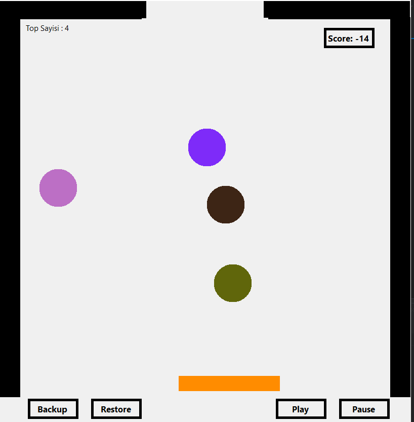
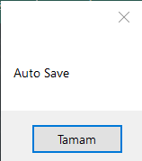
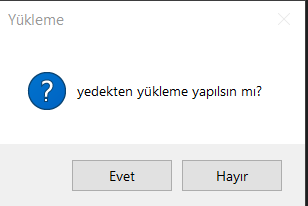
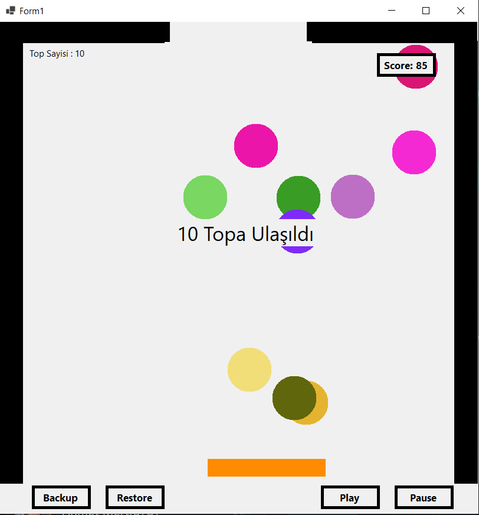

# Top Sektirme Oyunu ⚽
# Genel Özet
Bu proje  Görsel Programlama dersi için c# öğrenirken öğrendiklerimizi uygulamamız için verilmiş bir ödevdir. Oyunun amacı topun ekrandaki kenarlardan ve ortadaki çubuktan 
sekerek belirli bir bölgeden geçirip ekrandan çıkarmak. Oyun verileri JSON formatında şifreli olarak 
saklanmaktadır. İstendiği zaman veriler okunabilir yazılabilir. Böylece oyuncu oyunu kaldığı yerde 
kaydedebilir veya kaydettiği yerden devam edebilir.

# Uygulama İçi Görseller
    

## AutoSave 
 

Oyunda 15 saniyede bir otomatik olarak oyunun o anki durumunu JSON formatında şifreli olarak kaydeder. Oyun kapanırsa veya kullanıcı o noktaya geri dönmek isterse Restore butonuna bastığında oyunun bu verileri tekrar yüklenir ve kaldığı yerden devam eder.

## Oyunun yeniden yüklenmesi
 

AutoSave veya kullanıcının kendi isteğiyle kaydetmesi sonucu oluşan JSON formatindaki backup dosyası. Oyuna tekrar yüklenmek istediğinde karşılaşılan ekran.
Kaydedilen veri şifreli oldugundan şifre çözülür daha  sonrasında JSON formatındaki veri okunur ve oyunu o kayıt edilen duruma getirir.

##  Oyunu Kaybetme
 

Oyuna belli aralıkla top eklenir ve amaç bu topları yukardaki ufak boşluktan dışarı çıkarmak. O toplar eğer altta ok tuşlarıyla hareket eden bloğa temas etmeyip aşağı düşerse oyuna düşen top başına 2 top daha eklenir ve score 10 azalır.
10 topa ulaşıldığında ise oyun durur ve oyun kaybedilmiştir.

# İletişim
[E-posta](mustafaeren790@gmail.com)

[Linkedin](https://www.linkedin.com/in/mustafa-eren-9214661b3/)
